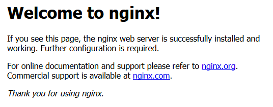
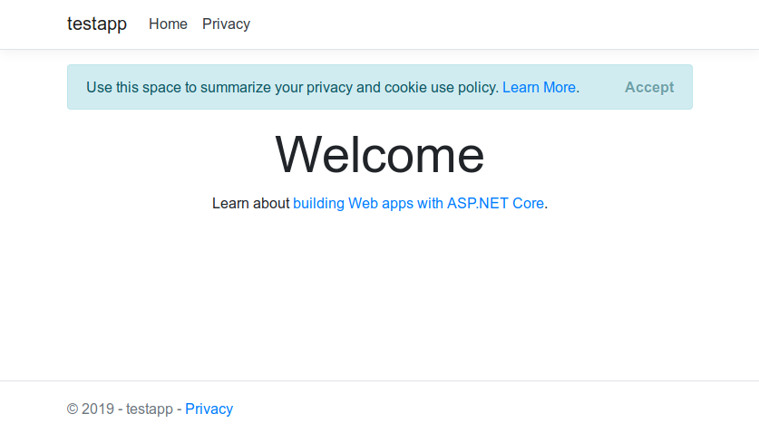

Small Linux VMs are super cheap option to host .NET Core webapps. I am hosting this blog on a VM from [INIZ](https://iniz.com/)

Let's run through how to deploy .NET Core web app onto a brand new VM. I've opted for Ubuntu 16.04 LTS as my OS image.

 1. [Disable root access](#disable-root-access)
 2. [Install .NET SDK](#install.net-sdk)
 3. [Publish app to the Server](#publish-app-to-the-server)
 4. [Setup reverse proxy](#setup-reverse-proxy)
 5. [Create service](#create-service)
 6. [Add an SSL certificate with Certbot](#add-an-ssl-certificate-with-certbot)

 
## Disable root access

First thing I always do on a server is to disable root access. There are many article on how to do this, but while developing I tend to just create a new user and give it `sudo` priveledges.

As root, create a new user and give it a strong password

```bash
$ adduser james
$ usermod -aG sudo james
```
Install nano and then edit **sshd_config**

```bash
$ sudo nano /etc/ssh/ssdh_config
```
Change **PermitRootLogin** to no and add an **AllowUsers** entry
```
PermitRootLogin no
AllowUsers james
```
Restart `ssh` service
```bash
sudo systemctl restart sshd
```

You can now reconnect to your machine with your new user name.

## Install .NET SDK

Following the linux install instructions from the [.NET website](https://dotnet.microsoft.com/download), install the .NET Core SDK (you can just install the runtime if you are deploying published apps - but I prefer to be able to build on the server if I need)

In my case, I had to run the following. Firstly  install the Microsoft package sources:

```bash
$ wget -q https://packages.microsoft.com/config/ubuntu/16.04/packages-microsoft-prod.deb
$ sudo dpkg -i packages-microsoft-prod.deb
```

And then install the .NET SDK

```bash
$ sudo apt-get install apt-transport-https
$ sudo apt-get update
$ sudo apt-get install dotnet-sdk-2.2
```

Make sure it's installed by running
```bash
$ dotnet --version
```


## Publish app to the Server

We are going to primarily be using the instructions from Microsoft Docs to [Host ASP.NET Core on Linux](https://docs.microsoft.com/en-us/aspnet/core/host-and-deploy/linux-nginx?view=aspnetcore-2.2) to deploy our app. 

we will deploy our app to the `/var/www/` directory, so first we need to create a folder for our application and give access to both our user and he `www-data` user (which we will be using to run the app later)

```bash
$ sudo mkdir /var/www/<your app>
$ sudo chown -R james:www-root /var/www/<your app>
```

We then need to copy our application to the server - you could just copy it to the server using FTP or SCP - but there is an excellent tool available called [dotnet-publish-ssh](https://github.com/albekov/dotnet-publish-ssh)

To use it you simply add a tool reference to your project's `csproj` file:
```xml
<ItemGroup>
    <DotNetCliToolReference Include="DotnetPublishSsh" Version="0.1.0" />
</ItemGroup>
```

From your build machine, run
```bash
$ dotnet restore
$ dotnet publish-ssh --ssh-host <address of your server> --ssh-user <username> --ssh-password <your password> --ssh-path /var/www/<path to your site>
```


Later we'll set up a CI pipeline to publish our app automatically{.alert .alert-info}


## Setup reverse proxy

A reverse proxy will forward requests made to our server to our app. Again, we will be following the directions on the Microsoft Docs site to [Configure a reverse proxy server](https://docs.microsoft.com/en-us/aspnet/core/host-and-deploy/linux-nginx?view=aspnetcore-2.2#configure-a-reverse-proxy-server)


We follow the docs from NGINX ([here](https://www.nginx.com/resources/wiki/start/topics/tutorials/install/#official-debian-ubuntu-packages)) to install the Ubuntu release.

First we need to add the repository to our `sources.list` file. We will use nano
```bash
$ sudo nano /etc/apt/sources.list
``` 
And add the following lines to the bottom of the file
```
deb http://nginx.org/packages/ubuntu/ xenial nginx
deb-src http://nginx.org/packages/ubuntu/ xenial nginx
```

Then simply run
```bash
$ sudo apt-get update
$ sudo apt-get install nginx
```

You can check that NGINX is running starting it with:
```bash
$ sudo service nginx start
```

If you navigate to your server's url, you should now see the default welcome page:



---
In my case, my server already had apache2 installed and running on port 80 - I had to disable this with: 

```bash
$ sudo service stop apache2
$ sudo update-rc.d apache2 disable
```
---

Next we need to configure NGINX to forward request to our app. You need to modify the `/etc/nginx/sites-available/default` file and replace the contents with:

```
server {
    listen        80;
    server_name   <your domain>;
    location / {
        proxy_pass         http://localhost:5000;
        proxy_http_version 1.1;
        proxy_set_header   Upgrade $http_upgrade;
        proxy_set_header   Connection keep-alive;
        proxy_set_header   Host $host;
        proxy_cache_bypass $http_upgrade;
        proxy_set_header   X-Forwarded-For $proxy_add_x_forwarded_for;
        proxy_set_header   X-Forwarded-Proto $scheme;
    }
}
```
Your will then need to enable the site by linking it to `etc/nginx/sites-enabled/default` with

```bash
$ sudo sn -l /etc/nginx/sites-available/default /etc/nginx/sites-enabled/
```

Also ensure that your default site is included in the `http` section of the config file for NGINX at `/etc/nginx/nginx.conf` - there should be a line like:
```text
http{
    ...

    include /etc/nginx/sites-available/default;
}
```

Once you have restarted the NGINX service, start your app with
```bash
$ dotnet <myapp>.dll
```

If you then visit your VM in the browser, you should see your wepapp running! 👏



## Create service

The next task is to set up our webapp to run as a service, so you don't have to be logged in to your server for your application to run.

Create a service file
```bash
$ sudo nano /etc/systemd/system/<myapp>.service
```

Enter your service information
```ini
[Unit]
Description=My application service

[Service]
WorkingDirectory=/var/www/<myapp>
ExecStart=/usr/bin/dotnet /var/www/<myapp>/<myapp>.dll
Restart=always
# Restart service after 10 seconds if the dotnet service crashes:
RestartSec=10
KillSignal=SIGINT
SyslogIdentifier=<myapp>
User=www-data
Environment=ASPNETCORE_ENVIRONMENT=Production
Environment=DOTNET_PRINT_TELEMETRY_MESSAGE=false

[Install]
WantedBy=multi-user.target

```

## Add an SSL certificate with Certbot

The final step is to secure our website with an SSL certificate from [Let's Encrypt](https://letsencrypt.org/) by using [certbot](https://certbot.eff.org/).

Add the Certbot PPA and install with
```bash
$ sudo apt-get install software-properties-common
$ sudo add-apt-repository universe
$ sudo add-apt-repository ppa:certbot/certbot
$ sudo apt-get update
$ sudo apt-get install certbot python-certbot-nginx 
```

Then simply run 
```bash
$ sudo certbot --nginx
```
And follow  the prompts. If you have entered your domain in the NGINX site configuration, certbot will ask you which domain you would like to create a certificate for and ask you if you ant to redirect traffic to HTTPS.

If everything goes to plan when you visit your site you will have a nice green padlock in the address bar!

---

Congratulations!  You have you app up and running on your VM! 🎉


